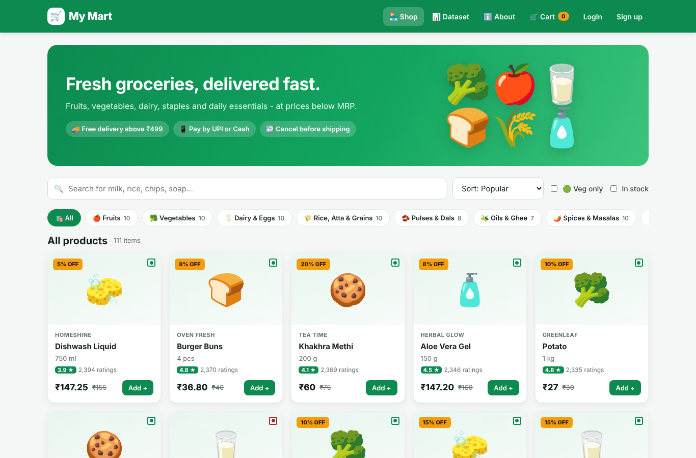
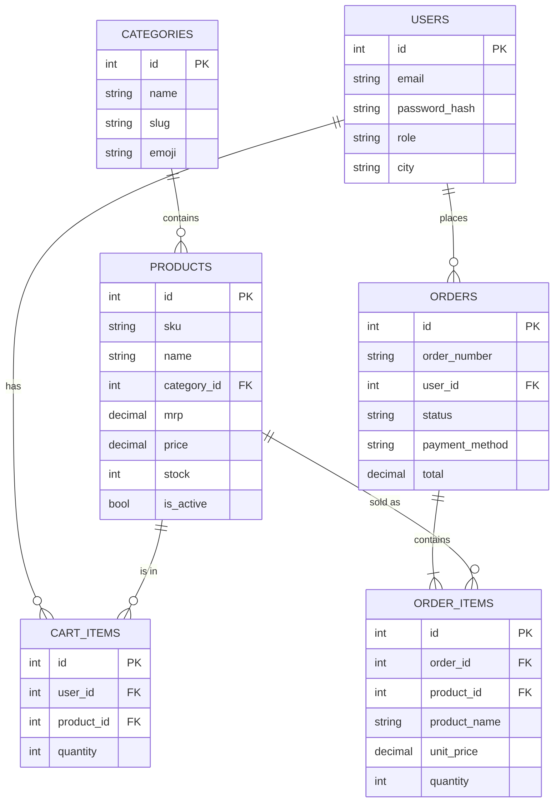
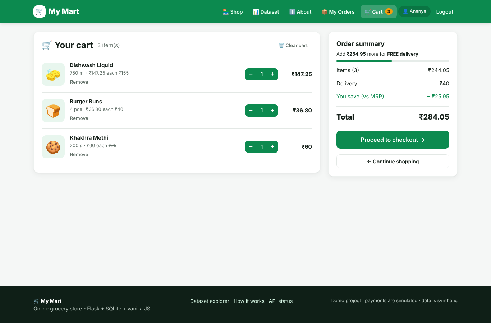
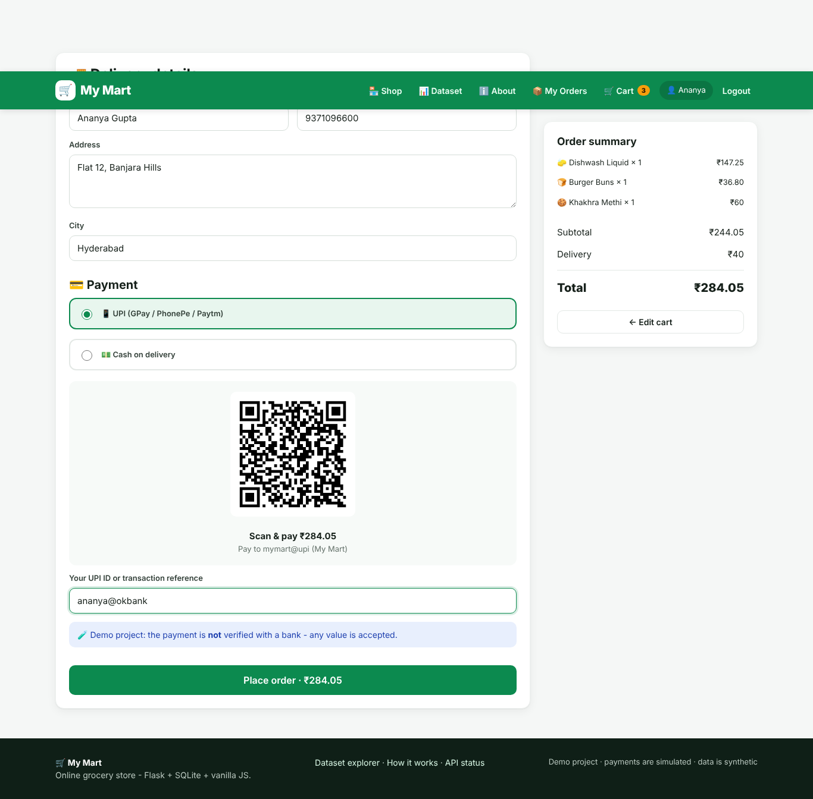
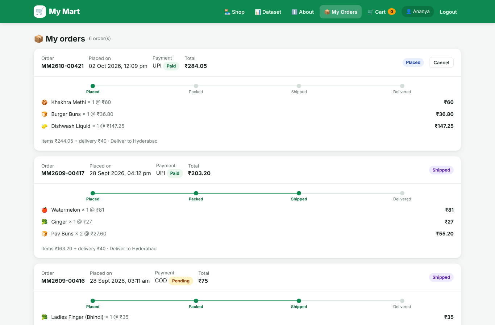
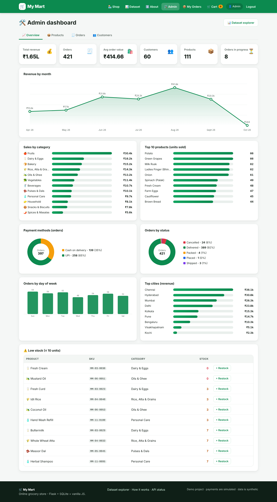
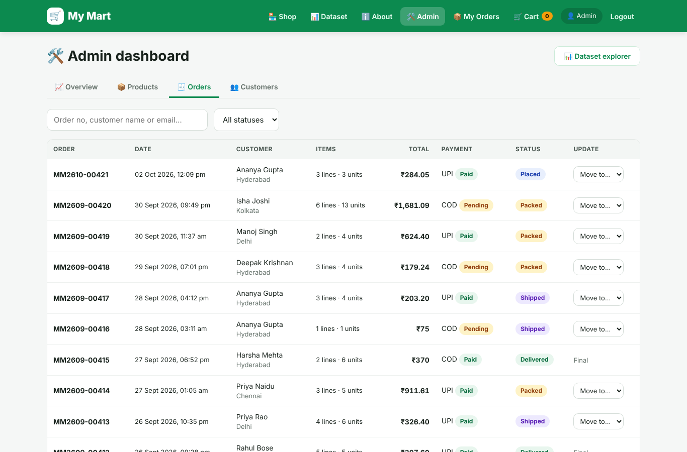
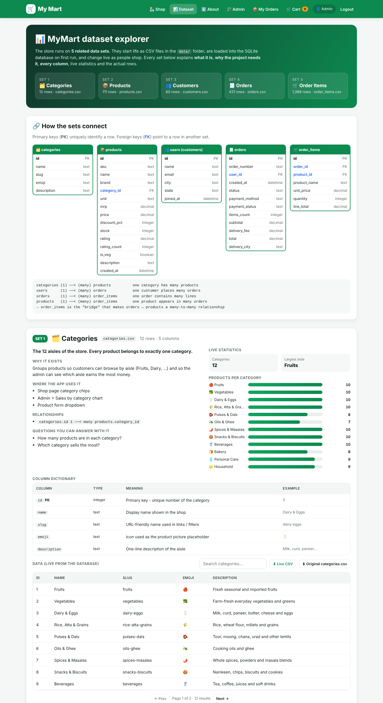
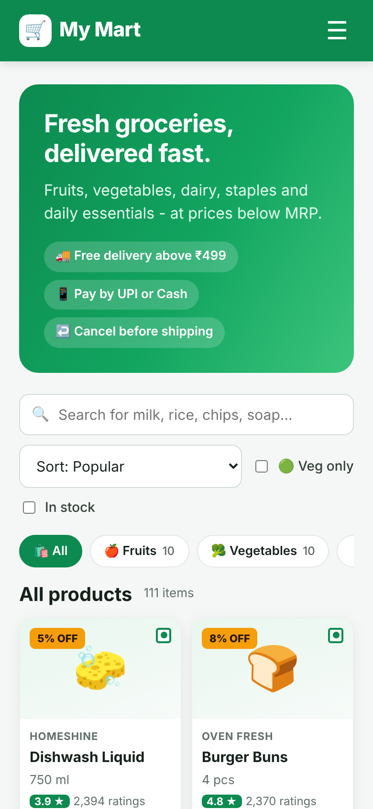

# 🛒 My Mart — Full-Stack Online Grocery Store

My Mart is an online grocery store you can run on your own computer. A **Flask REST API** handles the backend, a **SQLite database** stores the data, and a plain **HTML/CSS/JavaScript frontend** talks to the API. A **5-part sample dataset** is loaded on first run, and every part of it can be browsed in the app's **Dataset Explorer**.

> Runs at **http://localhost:5000**. You only need Python. There's no Node.js, no build step, and no external database.



---

## 📑 Table of contents
1. [Features](#-features)
2. [Tech stack & libraries](#-tech-stack--required-libraries)
3. [Quick start (setup)](#-quick-start)
4. [Demo accounts](#-demo-accounts)
5. [Project structure](#-project-structure)
6. [The dataset: set-by-set explanation](#-the-dataset--set-by-set-explanation)
7. [Database design](#-database-design)
8. [REST API](#-rest-api)
9. [Running the tests](#-running-the-tests)
10. [Screenshots](#-screenshots)
11. [Configuration](#-configuration-env)
12. [Troubleshooting](#-troubleshooting)
13. [Publishing to GitHub](#-publishing-this-project-to-github)

---

## ✨ Features

| For customers 🛍️ | For the admin 🛠️ | For everyone 📊 |
|---|---|---|
| Register / log in (passwords are hashed) | KPI cards: revenue, orders, AOV, customers | **Dataset Explorer** page |
| Search, category chips, veg-only, in-stock filter | Revenue-by-month line chart | Each of the 5 data sets explained |
| Sort by popularity, price, discount, rating, newest | Sales by category, top 10 products | Column dictionary (meaning + example) |
| Product page with related items | Payment split, order status, weekday, top cities | Live stats + chart for each set |
| Cart saved in the database (survives logout) | Low-stock alert with one-click restock | Search & paginate the real rows |
| Free-delivery progress bar (free above ₹499) | Add / edit / remove products | Download as CSV (live or original) |
| Checkout with **UPI QR code** or **Cash on Delivery** | Move orders: Placed → Packed → Shipped → Delivered | ER diagram of how the sets connect |
| Order tracking timeline + cancel before shipping | Customer list with orders & total spent | About page explaining the architecture |

Stock is checked whenever something goes into the cart and checked again at checkout. It goes down when an order is placed and comes back when an order is cancelled.

---

## 🧰 Tech stack & required libraries

| Layer | Technology |
|---|---|
| Language | **Python 3.10+** (tested on 3.13) |
| Web framework | **Flask 3** with blueprints and an app factory |
| Database | **SQLite** through **Flask-SQLAlchemy / SQLAlchemy 2** (ORM) |
| Authentication | **Flask-Login** sessions + **Werkzeug** password hashing |
| Payments | **qrcode[pil]**, which builds a real `upi://pay` QR code (demo only: payments are not verified) |
| Config | **python-dotenv** (reads `.env`) |
| Frontend | HTML5, CSS3, vanilla JavaScript (`fetch` API), hand-written SVG charts that work offline |
| Tests | Python `unittest` (19 API tests; `pytest` also works) |

All of these are in **`requirements.txt`**:

```text
Flask>=3.0            Flask-SQLAlchemy>=3.1     SQLAlchemy>=2.0
Flask-Login>=0.6.3    Werkzeug>=3.0             qrcode[pil]>=7.4
python-dotenv>=1.0
```

---

## 🚀 Quick start

### Option A: one click
* **Windows:** double-click **`start.bat`**
* **macOS / Linux:** run `./start.sh`

The script creates a virtual environment, installs the libraries and starts the server.

### Option B: step by step

```bash
# 1. Get the code
git clone https://github.com/<your-username>/MyMart.git
cd MyMart

# 2. Create and activate a virtual environment
python -m venv venv
venv\Scripts\activate          # Windows (PowerShell / CMD)
source venv/bin/activate       # macOS / Linux

# 3. Install the required libraries
pip install -r requirements.txt

# 4. (optional) copy the settings file and edit it
copy .env.example .env         # Windows
cp .env.example .env           # macOS / Linux

# 5. Start the server
python run.py
```

Then open **http://localhost:5000** 🎉

On the **first run** the app creates `backend/instance/mymart.db` and loads the sample dataset from `data/*.csv` by itself:

```
 * First run: loading the sample dataset from data/*.csv ...
Seeded: 12 categories, 111 products, 61 users, 420 orders, 1385 order items
  MyMart is running ->  http://localhost:5000
```

### Useful commands

| Command | What it does |
|---|---|
| `python run.py` | Start the server on http://localhost:5000 |
| `python manage.py stats` | Show the row count of every table |
| `python manage.py reset-db` | Delete everything and reload the CSV dataset |
| `python manage.py create-admin` | Create or reset the admin using `.env` values |
| `python manage.py export` | Save the live tables (with new orders) to `exports/*.csv` |
| `python data/generate_dataset.py` | Rebuild the 5 CSV files (same seed, so the output is identical) |
| `python -m unittest discover -s backend/tests -t .` | Run the test suite |

---

## 🔑 Demo accounts

| Role | Email | Password |
|---|---|---|
| Admin | `admin@mymart.com` | `Admin@123` |
| Customer | `ananya.gupta1@example.com` | `Customer@123` |
| Any of the 60 customers | see `data/customers.csv` | `Customer@123` |

The login page has **"Use customer" / "Use admin"** buttons that fill these in. Change the admin password in `.env` before you show the project to anyone.

---

## 🗂️ Project structure

```
MyMart/
├── run.py                    ← start the app (python run.py)
├── manage.py                 ← database commands (reset-db, export, stats…)
├── requirements.txt          ← required Python libraries
├── .env.example              ← settings template (copy to .env)
├── start.bat / start.sh      ← one-click setup + run
│
├── backend/                  ← BACKEND (Flask REST API)
│   ├── app/
│   │   ├── __init__.py       ← app factory: config, DB, blueprints, serves frontend
│   │   ├── config.py         ← settings (reads .env)
│   │   ├── extensions.py     ← db (SQLAlchemy) + login manager
│   │   ├── seed.py           ← loads data/*.csv into the database
│   │   ├── utils.py          ← ApiError, admin_required, pagination helpers
│   │   ├── models/           ← database tables (one file per table)
│   │   │   ├── category.py  product.py  user.py  cart.py  order.py
│   │   └── api/              ← REST endpoints (all under /api)
│   │       ├── auth.py       ← register / login / logout / me
│   │       ├── products.py   ← categories, product search & details
│   │       ├── cart.py       ← cart CRUD + totals
│   │       ├── orders.py     ← UPI QR, checkout, order history, cancel
│   │       ├── admin.py      ← stats, analytics, product & order management
│   │       └── dataset.py    ← Dataset Explorer API + set explanations
│   ├── instance/mymart.db    ← SQLite database (auto-created, git-ignored)
│   └── tests/test_api.py     ← 19 automated API tests
│
├── frontend/                 ← FRONTEND (HTML + CSS + JS)
│   ├── index.html            ← shop
│   ├── product.html  cart.html  checkout.html  orders.html
│   ├── login.html  register.html
│   ├── admin.html            ← admin dashboard (overview / products / orders / customers)
│   ├── dataset.html          ← Dataset Explorer
│   ├── about.html  404.html
│   ├── css/style.css
│   └── js/app.js (API helper, navbar, cart)  js/charts.js (SVG charts)
│
├── data/                     ← DATASET (5 CSV files + generator + data card)
│   ├── categories.csv  products.csv  customers.csv  orders.csv  order_items.csv
│   ├── generate_dataset.py
│   └── README.md             ← full dataset documentation
│
└── docs/
    ├── API.md                ← every endpoint with examples
    ├── DATABASE.md           ← ER diagram + table design
    ├── UPGRADE_NOTES.md      ← what changed from the original version
    └── screenshots/
```

---

## 📊 The dataset: set-by-set explanation

The store runs on **5 related data sets** stored as CSV files in [`data/`](data/). GitHub shows CSV files as searchable tables, so you can click one and browse it. When the app is running, the same data shows up live at **http://localhost:5000/dataset**.

All people, phone numbers, e-mails and brands are **synthetic** (invented). The generator uses a fixed random seed, so `python data/generate_dataset.py` always rebuilds exactly the same files.

| # | Set | File | Rows | One row = |
|---|---|---|---|---|
| 1 | 🗂️ Categories | [`categories.csv`](data/categories.csv) | 12 | an aisle of the store |
| 2 | 📦 Products | [`products.csv`](data/products.csv) | 111 | a product you can buy |
| 3 | 👥 Customers | [`customers.csv`](data/customers.csv) | 60 | a registered customer |
| 4 | 🧾 Orders | [`orders.csv`](data/orders.csv) | 420 | one checkout (receipt header) |
| 5 | 🛒 Order items | [`order_items.csv`](data/order_items.csv) | 1,385 | one product line inside an order |

### Set 1: Categories 🗂️
**What it is:** the 12 aisles of the store (Fruits, Vegetables, Dairy & Eggs, Rice/Atta/Grains, Pulses & Dals, Oils & Ghee, Spices & Masalas, Snacks & Biscuits, Beverages, Bakery, Personal Care, Household).
**Why it's needed:** customers browse by aisle, and the admin can see which aisle earns the most.
**Columns:** `id` (PK), `name`, `slug` (URL-friendly name), `emoji` (used as the product picture), `description`.
**Used in:** the shop's category chips, the admin "Sales by category" chart, and the product form dropdown.

### Set 2: Products 📦
**What it is:** 111 everyday Indian grocery items with realistic 2026 prices.
**Why it's needed:** this is what customers search, filter and buy. Stock goes down on every order. A few items are deliberately low or out of stock so the low-stock alert has something to show.
**Columns:** `id` (PK), `sku` (unique code `MM-<cat>-<id>`), `name`, `brand` (fictional), `category_id` (FK → categories), `unit` (pack size), `mrp`, `price` (selling price ≤ MRP), `discount_pct`, `stock`, `rating` (1–5), `rating_count`, `is_veg`, `description`, `created_at`.
**Used in:** the shop grid, search, sorting, cart and checkout, the admin product table and the low-stock alert.

### Set 3: Customers 👥
**What it is:** 60 synthetic customers in 10 Indian cities (Hyderabad, Bengaluru, Chennai, Mumbai, Pune, Delhi, Kolkata, Visakhapatnam, Kochi, Ahmedabad).
**Why it's needed:** customers own carts and orders, and their city shows where sales come from. Every demo customer can log in with `Customer@123`.
**Columns:** `id` (PK), `name`, `email` (`@example.com`), `phone`, `city`, `state`, `joined_at`.
**Privacy:** passwords are stored only as salted hashes. The live explorer masks e-mails and never shows phone numbers.

### Set 4: Orders 🧾
**What it is:** 420 orders placed between April and September 2026, one row per checkout.
**Why it's needed:** it's the receipt header (who, when, how they paid, delivery status, totals), and every revenue number on the admin dashboard comes from it.
**Columns:** `id` (PK), `order_number` (`MM<yymm>-<id>`), `user_id` (FK → customers), `created_at`, `status`, `payment_method` (UPI/COD), `payment_status`, `items_count`, `subtotal`, `delivery_fee`, `total`, `delivery_city`.
**Business rules:**
* `subtotal` = sum of the order's `order_items.line_total`
* `delivery_fee` = ₹0 if subtotal ≥ ₹499, otherwise ₹40
* `total` = subtotal + delivery_fee
* Status flow: **Placed → Packed → Shipped → Delivered** (or **Cancelled** before delivery)
* Cancelled orders don't count as revenue. Cancelled UPI payments become *Refunded*.

### Set 5: Order items 🛒
**What it is:** 1,385 order lines, one for each product inside an order.
**Why it's needed:** it links orders and products, which makes them a *many-to-many* relationship. `product_name` and `unit_price` are **snapshots** taken at purchase time, so an old receipt stays correct even if a price changes later.
**Columns:** `id` (PK), `order_id` (FK → orders), `product_id` (FK → products), `product_name`, `unit_price`, `quantity`, `line_total` (= unit_price × quantity).
**Used in:** order details, the admin's top-10 products and sales by category.

### Quick facts from the dataset
* **Revenue:** ≈ ₹1.64 lakh across 396 non-cancelled orders, with an average order value of about ₹415
* **Payment split:** about 65 % UPI and 35 % Cash on Delivery
* **Cancellation rate:** about 5.7 %
* **Top sellers:** everyday staples such as potatoes, grapes, milk rusk, onions and bhindi
* **Monthly revenue** grows from ~₹15.6k in April to ~₹41.8k in August

The full data card, with every column, how the data was generated, and known limitations, is in **[data/README.md](data/README.md)**.

---

## 🗄️ Database design



There are 6 tables: the 5 dataset tables plus `cart_items`, which stays empty until people start shopping. Integrity is enforced with foreign keys, unique constraints (email, SKU, one cart line per product) and check constraints (stock ≥ 0, price ≥ 0, quantity > 0). See **[docs/DATABASE.md](docs/DATABASE.md)** for details.

---

## 🔌 REST API

Every endpoint is under `/api` and returns JSON. Here are the main ones (full reference with examples in **[docs/API.md](docs/API.md)**):

| Method | Endpoint | Auth | Purpose |
|---|---|---|---|
| POST | `/api/auth/register` · `/login` · `/logout` | – | Accounts |
| GET | `/api/auth/me` | – | Who is logged in |
| GET | `/api/categories` | – | All categories with product counts |
| GET | `/api/products?q=&category=&sort=&veg=&in_stock=&page=` | – | Search / filter / sort / paginate |
| GET | `/api/products/<id>` | – | Product details + related products |
| GET · POST · DELETE | `/api/cart` | user | View / add to / clear the cart |
| PATCH · DELETE | `/api/cart/<product_id>` | user | Change quantity / remove |
| GET | `/api/checkout/upi-qr.png` | user | UPI QR code for the cart total |
| POST | `/api/orders` | user | Place an order |
| GET | `/api/orders` · `/api/orders/<id>` | user | Order history |
| POST | `/api/orders/<id>/cancel` | user | Cancel (Placed/Packed only) |
| GET | `/api/admin/stats` · `/api/admin/analytics` | admin | Dashboard numbers & charts |
| GET · POST · PUT · DELETE | `/api/admin/products[/<id>]` | admin | Manage products |
| GET · PATCH | `/api/admin/orders[/<id>]` | admin | Manage order status |
| GET | `/api/admin/customers` | admin | Customers + spend |
| GET | `/api/dataset` · `/api/dataset/<set>` | – | Dataset explorer data |
| GET | `/api/dataset/<set>/download` · `/original` | – | CSV downloads |

Try it from a terminal: `curl http://localhost:5000/api/products?q=rice&sort=price_asc`

---

## 🧪 Running the tests

```bash
python -m unittest discover -s backend/tests -t . -v
# or, if you installed requirements-dev.txt:
pytest
```

The 19 tests run against a fresh in-memory database and cover the catalogue, search, auth, the cart, stock limits, checkout, cancel/restock, delivery fee rules, the UPI QR code, admin permissions, product CRUD, order status rules and the dataset API.

---

## 🖼️ Screenshots

| Shop | Cart |
|---|---|
|  |  |
| **Checkout (UPI QR)** | **My orders** |
|  |  |
| **Admin dashboard** | **Admin: orders** |
|  |  |
| **Dataset explorer** | **Mobile** |
|  |  |

---

## ⚙️ Configuration (.env)

Copy `.env.example` to `.env`. All settings are optional.

| Variable | Default | Meaning |
|---|---|---|
| `SECRET_KEY` | dev value | Signs login cookies. **Change it.** |
| `PORT` | `5000` | Port of the local server |
| `ADMIN_EMAIL` / `ADMIN_PASSWORD` | `admin@mymart.com` / `Admin@123` | Admin created on first run |
| `MERCHANT_UPI_ID` | `mymart@upi` | **Your UPI ID** shown in the checkout QR |
| `FREE_DELIVERY_ABOVE` / `DELIVERY_FEE` | `499` / `40` | Delivery rule |
| `LOW_STOCK_THRESHOLD` | `10` | When the admin alert shows a product |
| `AUTO_SEED` | `true` | Load `data/*.csv` when the DB is empty |
| `DATABASE_URL` | SQLite file | Any SQLAlchemy URL |

---

## 🩺 Troubleshooting

| Problem | Fix |
|---|---|
| `ModuleNotFoundError: flask_sqlalchemy` | Activate the venv, then run `pip install -r requirements.txt` |
| `'python' is not recognized` (Windows) | Install Python from python.org and tick **"Add Python to PATH"**, or use `py run.py` |
| Port 5000 already in use | Set `PORT=5001` in `.env` |
| Want fresh data | `python manage.py reset-db` |
| PowerShell won't activate the venv | `Set-ExecutionPolicy -Scope CurrentUser RemoteSigned` |
| Forgot the admin password | Set `ADMIN_PASSWORD` in `.env`, then run `python manage.py create-admin` |

---

## 🌍 Publishing this project to GitHub

```bash
git init
git add .
git commit -m "My Mart: full-stack grocery store with dataset explorer"
git branch -M main
git remote add origin https://github.com/<your-username>/MyMart.git
git push -u origin main
```

`.gitignore` already keeps out the virtual environment, `.env` (your secrets) and the database file. Anyone who clones the repo gets the same data, because the CSV files rebuild it on first run.

---

## ⚠️ Disclaimer
This is a learning and portfolio project. UPI payments are **simulated**: the QR code is real, but the payment is never verified with a bank or payment gateway. All data is synthetic.

## 📄 License
[MIT](LICENSE) © 2026 Ram
