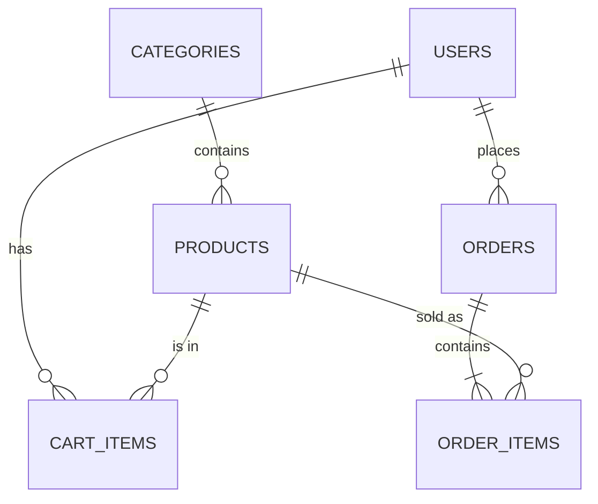

# 🗄️ Database design

**Engine:** SQLite (file `backend/instance/mymart.db`, created automatically)
**ORM:** Flask-SQLAlchemy. Each table is a Python class in `backend/app/models/`.

Because the code goes through SQLAlchemy, you can switch to PostgreSQL or MySQL by setting `DATABASE_URL` in `.env`. The only SQLite-specific functions are the `strftime` calls used in the analytics queries.

## Entity–relationship diagram



## Tables

### `categories`
| Column | Type | Constraints |
|---|---|---|
| id | INTEGER | PK |
| name | VARCHAR(80) | UNIQUE, NOT NULL |
| slug | VARCHAR(80) | UNIQUE, NOT NULL |
| emoji | VARCHAR(8) | |
| description | VARCHAR(255) | |

### `products`
| Column | Type | Constraints |
|---|---|---|
| id | INTEGER | PK |
| sku | VARCHAR(30) | UNIQUE, NOT NULL |
| name | VARCHAR(150) | NOT NULL, indexed |
| brand | VARCHAR(80) | |
| category_id | INTEGER | FK → categories.id, NOT NULL, indexed |
| unit | VARCHAR(40) | |
| mrp, price | NUMERIC(10,2) | NOT NULL, `price >= 0` |
| stock | INTEGER | NOT NULL, `stock >= 0` |
| rating | FLOAT | |
| rating_count | INTEGER | |
| is_veg | BOOLEAN | |
| description | TEXT | |
| image_url | VARCHAR(255) | optional picture (an emoji is shown when empty) |
| is_active | BOOLEAN | **soft delete**: removed products stay linked to old orders |
| created_at | DATETIME | |

### `users`
| Column | Type | Constraints |
|---|---|---|
| id | INTEGER | PK |
| name | VARCHAR(120) | NOT NULL |
| email | VARCHAR(150) | UNIQUE, NOT NULL, indexed |
| phone | VARCHAR(15) | |
| password_hash | VARCHAR(255) | NOT NULL (Werkzeug scrypt hash) |
| role | VARCHAR(20) | `customer` or `admin` |
| city, state | VARCHAR(80) | |
| created_at | DATETIME | |

### `cart_items`
| Column | Type | Constraints |
|---|---|---|
| id | INTEGER | PK |
| user_id | INTEGER | FK → users.id (cascade) |
| product_id | INTEGER | FK → products.id (cascade) |
| quantity | INTEGER | `quantity > 0` |
| added_at | DATETIME | |
| | | UNIQUE (user_id, product_id): one line per product |

### `orders`
| Column | Type | Constraints |
|---|---|---|
| id | INTEGER | PK |
| order_number | VARCHAR(20) | UNIQUE |
| user_id | INTEGER | FK → users.id, indexed |
| created_at | DATETIME | indexed |
| status | VARCHAR(20) | Placed / Packed / Shipped / Delivered / Cancelled |
| payment_method | VARCHAR(10) | UPI / COD |
| payment_status | VARCHAR(20) | Paid / Pending / Refunded / Cancelled |
| upi_ref | VARCHAR(150) | UPI id / transaction ref typed by customer |
| items_count | INTEGER | |
| subtotal, delivery_fee, total | NUMERIC(10,2) | |
| delivery_name, delivery_phone, delivery_address, delivery_city | VARCHAR | |

### `order_items`
| Column | Type | Constraints |
|---|---|---|
| id | INTEGER | PK |
| order_id | INTEGER | FK → orders.id (cascade), indexed |
| product_id | INTEGER | FK → products.id, indexed |
| product_name | VARCHAR(150) | snapshot |
| unit_price | NUMERIC(10,2) | snapshot |
| quantity | INTEGER | |
| line_total | NUMERIC(10,2) | |

## Design decisions

* **Snapshots in `order_items`**: the name and price are copied at purchase time, so a receipt never changes later.
* **Soft delete for products**: setting `is_active = false` hides a product from the shop but keeps it linked to old orders.
* **Cart in the database** (not in the browser session): the cart survives logout and works across devices.
* **Stock re-check at checkout**: stock is checked inside the same transaction that reduces it, so two customers can't buy the last unit twice.
* **Status state machine**: the admin can only move an order forward (Placed → Packed → Shipped → Delivered) or cancel it before delivery. Cancelling restocks the items and refunds UPI payments.

## Handy SQL (open the DB with [DB Browser for SQLite](https://sqlitebrowser.org/))

```sql
-- Revenue per month
SELECT strftime('%Y-%m', created_at) AS month, COUNT(*) AS orders, ROUND(SUM(total), 2) AS revenue
FROM orders WHERE status != 'Cancelled' GROUP BY month ORDER BY month;

-- Top 5 products by units sold
SELECT product_name, SUM(quantity) AS units FROM order_items
GROUP BY product_name ORDER BY units DESC LIMIT 5;

-- Revenue by category
SELECT c.name, ROUND(SUM(oi.line_total), 2) AS revenue
FROM order_items oi JOIN products p ON p.id = oi.product_id
JOIN categories c ON c.id = p.category_id
JOIN orders o ON o.id = oi.order_id AND o.status != 'Cancelled'
GROUP BY c.name ORDER BY revenue DESC;
```
